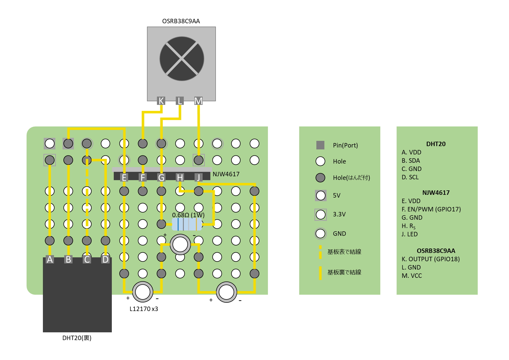
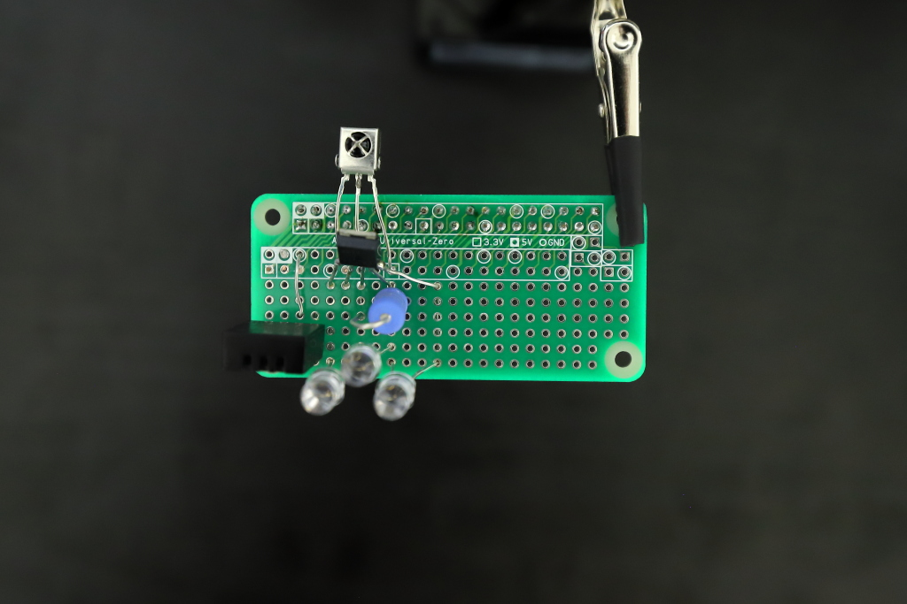
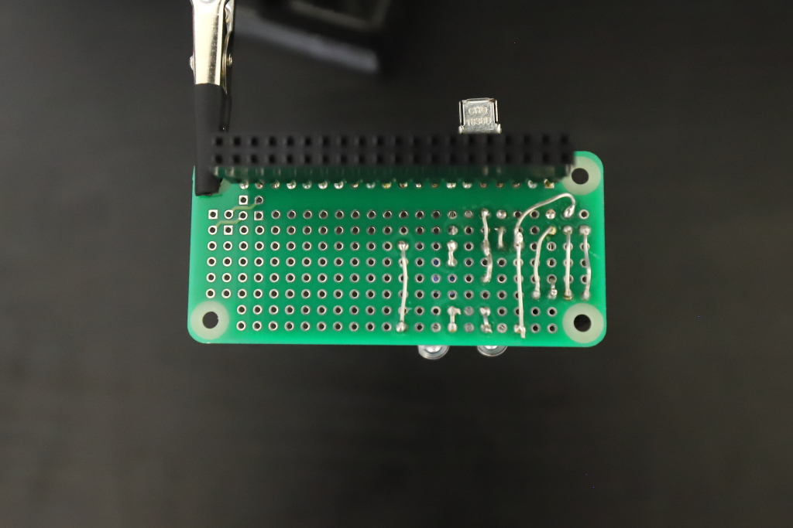
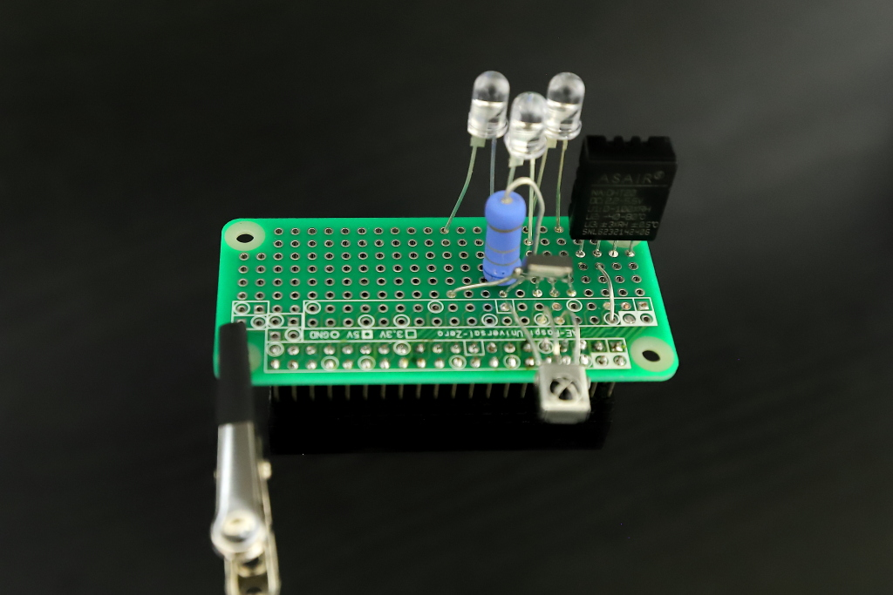

# rasp-smartremocon-api
自作スマートリモコン用APIパッケージ（参考：[ラズパイで自作スマートリモコン　LEDドライバを使ってパワーアップ！](https://qiita.com/rute/items/c840b362e9f83e796427)）

## 概要
- Raspberry Piをスマートリモコンとして動作させるためのソフトウェアのリポジトリです。
- スマートリモコンとして動作する回路は、自作していただきます。
- 自作スマートリモコンでは操作の難しい、ダイキン製のエアコン操作に対応したソフトウェアに改変されています。
- LEDドライバ NJW4617を活用し、安定しかつ広範囲から家電を操作できる回路の制作ノウハウを提供しています。


## 準備
- スマートリモコンを作成する手順書となります。
- 内容は拡充しますが、現状、『前提として必要な基礎知識』に該当する部分は詳細に記しておりませんので、よくわからない箇所は、ご自身で調査願います。


### 回路編
このリポジトリでスマートリモコンの開発を行うにあたり、回路制作が必要です。電子工作ですので、楽しみつつも、よく注意して実施してください。
#### 電子部品の購入
- 下記表の電子部品をご購入ください。下表は、必要最低限の部品に限定して記載します。

| 部品名称                                                                                                    | 販売価格(円) | 購入数(個) | 備考                                                                                               |
| :---------------------------------------------------------------------------------------------------------- | :----------- | :--------- | :------------------------------------------------------------------------------------------------- |
| [NJW4617DL3](https://akizukidenshi.com/catalog/g/g112989/)                                                  | 80           | 1          |                                                                                                    |
| [5mm赤外LED L12170](https://akizukidenshi.com/catalog/g/g112510/)                                           | 300          | 3          | 単価12円の[OSI5LA5113A](https://akizukidenshi.com/catalog/g/g112612/)でも代用可                    |
| [1W 0.68Ω±5%]()                                                                                             | 30           | 1          | OSI5LA5113A使用の場合は、単価1円の[2.2Ω](https://akizukidenshi.com/catalog/g/g114268/)の抵抗を使用 |
| [赤外線リモコン受信モジュールOSRB38C9AA](https://akizukidenshi.com/catalog/g/g104659/)                      | 100          | 1          | 2個入りのため単価は50円                                                                            |
| [温湿度センサー モジュール DHT20](https://akizukidenshi.com/catalog/g/g116732/)                             | 420          | 1          |                                                                                                    |
| [Raspberry Pi ZERO用ユニバーサル基板](https://akizukidenshi.com/catalog/g/g114031/)                         | 130          | 1          |                                                                                                    |
| [連結ピンソケット 2×20(40P) ラズパイ用スタッキングコネクター](https://akizukidenshi.com/catalog/g/g110702/) | 150          | 1          |                                                                                                    |

- 別途、はんだごて・はんだ・はんだ吸い取り線等、必要なものをご購入ください。
- 試作をしたい方は、ジャンパワイヤ線・ブレッドボードもご購入ください。

#### 回路の制作
- 下図に従って、回路を制作してください。



- 最後に、ユニバーサル基板とピンソケットをはんだ付けします。

- L12170の代わりに、OSI5LA5113Aを使用する場合は、L12170の部分をOSI5LA5113Aに置き換え、0.68Ωの抵抗を2.2Ωのものに置き換えてください。
- はんだ付けを実施する際は、作業スペースを整理整頓・作業しやすいよう十分なスペースを確保し、やけどに注意してください。

- 参考までに、制作例を画像添付します。(お手本には到底なりませんが、ご了承ください。)

【表面】



【裏面】



【側面(俯瞰)】




### Raspberry Pi編
スマートリモコンの開発の土台となるRaspberry Pi（ラズパイ）のセットアップについて解説します。

#### ラズパイの購入
- 以下に標準仕様として推奨するラズパイと、最低限必要な周辺機器を記載します。

| 部品名称                                                                                                          | 販売価格(円) | 購入数(個) | 備考                                                                                                               |
| :---------------------------------------------------------------------------------------------------------------- | :----------- | :--------- | :----------------------------------------------------------------------------------------------------------------- |
| [Raspberry Pi Zero WH (ラズベリーパイゼロ ダブルエイチ) ケース付き](https://akizukidenshi.com/catalog/g/g112958/) | 4280         | 1          | 余談ですが、以前は2680円で買ってたみたいなのですが... 時代ですね。予算を考えるとPico版も開発したほうがよいと思っています。 |
| [スイッチングACアダプター(USB ACアダプター) MicroBオス 5V3A](https://akizukidenshi.com/catalog/g/g112001/)        | 1100         | 1          |                                                                                                                    |
| microSDカード                                                                                                     | 1000         | 1          |      PCで読み書きできようSDカード付のものを推奨。必要に応じてSDカードリーダを用意。                                                                                                              |

- 必要に応じてUSB接続のできるHappy Hacking等のキーボードやマウス、ディスプレイをご用意ください。
- Raspberry Pi Zeroの映像出力端子は**Mini HDMI**で、Raspberry Pi 4の端子は**Micro HDMI**で、両者は**似て非なるもの**ですので、アダプタ購入の際はご注意ください。

#### OSのインストール
- Raspberry Pi Imager・NOOBS等を使って、Rasbian OSをインストールしてください。インストール後は、下記コマンドを実施しておくと良いでしょう。
```bash
sudo apt-get update
sudo apt-get upgrade
sudo reboot
```
- パスワードの変更(セキュリティのため)や、SSHの有効化もお忘れなく。
- ラズパイのホスト名を`myremocon`等にしておくも良いでしょう。
- ネットワーク(WiFi)の設定もお忘れなきようお願いします。設定を忘れる・誤るとサーバを立てても正しく動作しなくなってしまいます。

#### スマートリモコン作動のための環境構築
- Python等の最低限のツール群がインストール済みか確認します。

##### Python
```bash
python3 -V
```
- 下記のような表示がでればOKです.
```bash
Python 3.9.3
```
- Command not foundになる場合は、Pythonのインストールをお願いします。

- Rasbian OSがインストールされていれば、このリポジトリで使用するFlask等もすでにインストールされているはずですので省略します。ただし、PyYAMLのみは手動インストールが必要です(なお`6.0.1`で動確)。
```bash
pip3 install PyYAML
```
- その他、必要であれば各自Packageの都度インストールをお願いします。
- 環境を汚したくない方は、venv環境の利用をオススメします。

##### tmux
- サーバをバックグラウンドで動作させる際に活用します。
```bash
sudo apt-get update
sudo apt-get install tmux
```

##### その他
- vim・emacs等必要なライブラリがあれば各自インストール願います。

#### pigpioのインストール
- GPIO制御のためpigpioをインストールします。
```bash
sudo apt install pigpio python3-pigpio
sudo systemctl enable pigpiod.service
sudo systemctl start pigpiod
```

#### GPIOの設定
- 上記の回路では、LED点灯(出力)にGPIO17、リモコンからの赤外線受信(入力)をGIPO18で行います。
```bash
echo 'm 17 w   w 17 0   m 18 r   pud 18 u' > /dev/pigpio
```
※GPIO17を書き出し(出力)に、GPIO18を読み込み(入力)に設定しています。

- ラズパイ起動後に自動で、GPIO設定を変えるために、cronを用いて下記設定を行うと良いでしょう。
```bash
crontab -e
```
- 初回のみエディタを何にするか聞かれるので、数字で回答後、ファイルの最後に下記を記載してください。
```bash
@reboot until echo 'm 17 w   w 17 0   m 18 r   pud 18 u' > /dev/pigpio; do sleep 1s; done
```
※[参考文献](https://qiita.com/takjg/items/e6b8af53421be54b62c9)


### スマートリモコン編
いよいよスマートリモコンとして作動させるための最終調整を実施します。

#### ラズパイと電子回路のドッキング
- 回路編で作成した回路と、ラズパイをドッキングしてください。
- ドッキングする向きに注意します。
- ラズパイ側のピンを折らないように注意してください。

#### リポジトリのダウンロード
- 必要であれば、SSH keyの作成をお願いします。
- [参考文献](https://qiita.com/suthio/items/2760e4cff0e185fe2db9)
```bash
# cloneするディレクトリは自由です(下記は一例)
cd ~/Documents/
# SSH keyを作成した場合
git clone git@github.com:RUTE-FSMUSEUM/rasp-smartremocon-api.git
```

#### 初期設定
- リモコンコードを保管する`codes`を作成します。
```bash
# Documents直下にcloneした場合。細かいところはおまかせします。
cd ~/Documents/rasp-smartremocon-api/
cp codes.sample codes
```

- サーバを立ち上げる際のコンフィギュレーションファイル`server.config.yaml`を作成します。
```bash
# ~/Documents/rasp-smartremocon-api/にいる前提です。
cd httpapi/
cp server.config.sample server.config.yaml
```
※必要に応じて、`server.config.yaml`の内容を編集してください。


## 使い方
このリポジトリにあるコード群の活用方法を説明します。

### リモコンコードを記憶させる
- 赤外線受信モジュールにリモコンを向けて、下記コマンドを実行したあと、任意のリモコンのボタンを操作します。
- 例えば、ライト点灯の場合は下記となります。`roomlight:on`の部分は自由に命名可能です。
- `roomlight:on`の部分は、必ず`[家電名]:[操作名]`としてください。`:`は家電名と操作名の間のみに使用してください。(それ以外の使用は禁止です、誤るとサーバを立てて家電を操作できなくなります)
```bash
python irrp.py -r -g18 -f codes roomlight:on
```
- [記事](https://qiita.com/rute/items/c840b362e9f83e796427)にも書きましたが、ダイキン製エアコンでは長めに受信するのがオススメです。
```bash
python irrp.py -r -g18 --post 512 --short 100 -f codes aircon:cool
```


### リモコンコードを送出する
- [前のセクション](#リモコンコードを記憶させる)で記憶させたリモコンコードをラズパイから送出します。
```bash
python irrp.py -p -g17 -f codes roomlight:on
```
- コードは改変してますので、`chain is too long`等のエラーが出る心配は不要です。


### サーバーを立てる
- Windows・Mac等の他のPCから、sshでラズパイへログインし、サーバを起動させます。
- サーバを立てれば、別のPC・スマートフォン等のデバイスから家電の操作が可能です。
```bash
# portを22から別のものへ変えている場合は -p [ポート番号] を入力する
ssh [ユーザ名]@[ラズパイのホスト名].local
tmux new -s server
cd ~/Documents/rasp-smartremocon-api/httpapi/
python3 api.py
# サーバが立ち上がったことを確認したら、 Ctrl+B のあとに D でtmuxから抜けます。
exit
```
- [OSのインストール](#OSのインストール)でラズパイのホスト名を`myremocon`に、ユーザ名を`taro`にした場合は、下記となります。
```bash
ssh taro@myremocon.local
```
- 再ログインし、サーバの終了等を実施したい場合は、下記を実施します。
```bash
ssh [ユーザ名]@[ラズパイのホスト名].local
# 特に何もしていなければ tmux a だけでも戻れます。
tmux a -t server
# ctrl+C 等でサーバを止めます。
```
- 例えば、`Ctrl+C`でサーバを止めた後に、リモコンコードを記憶させる場合は、下記を実施します。
```bash
cd ..
python irrp.py -r -g18 -f codes [家電名]:[操作名]
# 再度サーバを立てる場合は、下記実施
cd httpapi/
python3 api.py
```


### 別のデバイスからスマートリモコンを操作する
- サーバを立ち上げた状態で、手持ちのスマートフォンから下記URLにアクセスすることで、家電の操作が可能です。
- [こちら](#リモコンコードを送出する)で記憶した`roomlight:on`を実行する場合は、下記[家電名]を`roomlight`に、[操作名]を`on`に置換します。
```
http://[ホスト名].local:[指定のポート番号]/api?app=[家電名]&cmd=[操作名]
```
- ラズパイのホスト名を`myremocon`、`server.config.yaml`で`PORT`をデフォルトの`5050`に設定している場合は、下記となります。
- 下記では、 [こちら](#リモコンコードを送出する)で記憶したコード`roomlight:on`を送出します。
```
http://myremocon.local:5050/api?app=roomlight&cmd=on
```
- 念のため補足しますが、ラズパイはローカルサーバとして動作していますので、**ラズパイと同じネットワーク(WiFi)に接続している場合のみ**、上記URLより家電の操作が可能です。(宅外からの操作はできません)


## 謝辞
下記をはじめ、スマートリモコンの制作を補助してくださったすべてに厚く御礼申し上げます。
- ラズパイでスマートリモコンを自作することに対し背中を大いにおしてくださったじゃが いもさんに：[リンク](https://qiita.com/takjg/items/e6b8af53421be54b62c9)
- ダイキン製エアコンのリモコンコード解析の参考となりました：[リンク](http://www.neko.ne.jp/%7Efreewing/raspberry_pi/raspberry_pi_gpio_pigpio_ir_remote_control/#google_vignette)
- 安定して広範囲まで届くスマートリモコンの実現に大いに貢献してくれましたNJW4617製造元の日清紡マイクロデバイス株式会社さんに：[リンク](https://www.nisshinbo-microdevices.co.jp/ja/products/led-driver-controller/spec/?product=njw4617)
- リーズナブルな価格でお値段以上の働きをしてくれる計算機を提供してくれるラズベリーパイ財団へ：[リンク](https://www.raspberrypi.org/)
- 豊富な品揃えで、いつ行っても楽しい秋月電子通商さん、千石電商さんへ：[リンク](https://akizukidenshi.com/catalog/default.aspx)、[リンク](https://www.sengoku.co.jp/)
- pigipo・irrp.pyのコードを公開してくださったabyz.me.ukさんへ：[リンク](https://abyz.me.uk/rpi/pigpio/examples.html#Python%20code)
- 今年の夏も涼しく快適に過ごさせてくれるダイキン工業株式会社さんへ：[リンク](https://www.ac.daikin.co.jp/roomaircon)
- スマートなUIづくりに大いに貢献するフレームワークBootstrapの開発チームへ：[リンク](https://getbootstrap.com/)


## 今後の計画
- 温度・湿度センサ(DHT20)を活用してソフトウェアをアップグレードします。
- GUIも改善する予定です。


## おことわり
あなたがこのリポジトリを閲覧した結果生じた、損害・事故等のいかなる事象に対して、制作者は一切の責任を負いかねます。すべて自己責任のもとで実施してください。
